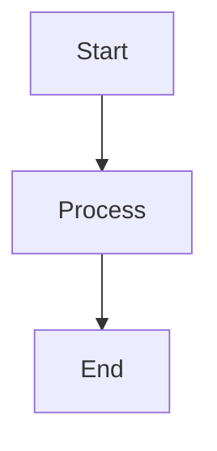

# CLAUDE.md

This file provides guidance to Claude Code (claude.ai/code) when working with code in this repository.

## Project Overview

This is a Next.js 15 blog website called "Mindful AI" - a thoughtful exploration of artificial intelligence with a focus on philosophy, ethics, and mindful technology use. The site features a zen-inspired design aesthetic with minimalist styling, built with React 19, TypeScript, and vanilla CSS with CSS custom properties.

## Architecture

The project uses Next.js App Router with MDX content management:

### Tech Stack
- **Next.js 15.5.4** (Turbopack disabled for remark-gfm compatibility)
- **React 19.1.0**
- **TypeScript 5**
- **Vanilla CSS** with CSS custom properties and modern features
- **MDX** (@next/mdx, @mdx-js/loader, @mdx-js/react, next-mdx-remote)
- **gray-matter** - YAML frontmatter parsing
- **reading-time** - Automatic reading time calculation
- **remark-gfm** - GitHub-flavored Markdown (tables, task lists, strikethrough)
- **highlight.js** and **shiki** - Syntax highlighting for code blocks
- **mermaid** - Diagram rendering support

### Directory Structure
- **app/** - Next.js app router pages and components
  - **app/page.tsx** - Main landing page with article listings
  - **app/layout.tsx** - Root layout with font configuration and ThemeProvider
  - **app/globals.css** - Global styles with vanilla CSS and CSS custom properties
  - **app/articles/[slug]/page.tsx** - Dynamic article page with MDXRemote rendering
  - **app/components/** - Reusable React components
    - **ArticleCard.tsx** - Article preview card component
    - **ThemeSwitcher.tsx** - Theme selection dropdown
    - **CodeBlock.tsx** - Syntax-highlighted code block component
    - **MermaidDiagram.tsx** - Client-side Mermaid diagram renderer
  - **app/providers/** - Context providers
    - **ThemeProvider.tsx** - Client-side theme management with localStorage
- **content/articles/** - MDX article files with YAML frontmatter
- **lib/** - Utility functions and shared logic
  - **lib/articles.ts** - Article fetching and metadata parsing
  - **lib/themes.ts** - Theme definitions and time-based theme logic
- **mdx-components.tsx** - Custom MDX component overrides (code blocks, Mermaid diagrams)
- **next.config.mjs** - Next.js configuration with MDX and remark-gfm support

### Design System

All pages share a consistent design language with CSS custom properties:

```css
--bg-primary: #FAFAF8 (off-white background)
--text-primary: #2C3E50 (dark blue-gray for body text)
--text-secondary: #5A6C7D (lighter blue-gray for secondary text)
--accent-sage: #7C9885 (sage green for accents)
--accent-light: #A8BFA8 (lighter sage for borders/highlights)
--border-light: #E8E8E8 (subtle borders)
```

**Typography:**
- Headings: 'Crimson Text' (serif)
- Body: 'Inter' (sans-serif, font-weight: 300)
- Code: 'JetBrains Mono' (monospace, technical articles only)

**Layout Philosophy:**
- Mobile-first responsive design with @media queries at 640px and 1024px
- Generous whitespace and breathing room
- Smooth transitions with `cubic-bezier(0.4, 0, 0.2, 1)`
- Accessibility support via `prefers-reduced-motion`

## Article System

### How Article Rendering Works

The blog uses a two-stage MDX rendering approach:

1. **Article Discovery** (`lib/articles.ts`):
   - `getArticleSlugs()` scans `content/articles/` directory for `.mdx` files
   - `getArticleBySlug(slug)` reads file, parses frontmatter with `gray-matter`, calculates reading time
   - `getAllArticles()` fetches all articles sorted by date (newest first)

2. **Article Rendering** (`app/articles/[slug]/page.tsx`):
   - Uses Next.js dynamic routes with `generateStaticParams()` for static site generation
   - Renders MDX with `next-mdx-remote` (server-side rendering)
   - Applies `remark-gfm` plugin for GitHub-flavored Markdown features
   - Passes custom components via `useMDXComponents()` for code blocks and diagrams

### MDX Article Format
Articles are written in MDX (Markdown + JSX) with YAML frontmatter:

```yaml
---
title: "Your Article Title"
date: "YYYY-MM-DD"
excerpt: "Brief description for article cards"
template: "article" | "short" | "technical"
category: "Category Name"
---
```

### Article Templates (Implemented)
- **Standard Article** (`template: "article"`) - Clean, readable format for medium-length content (5-12 minute reads)
- **Short Article** (`template: "short"`) - Minimalist, centered layout for brief reflections (2-4 minute reads)
- **Technical Article** (`template: "technical"`) - Comprehensive layout with code highlighting and Mermaid diagrams (10+ minute reads)

Template rendering is implemented in `app/articles/[slug]/page.tsx` and applies different CSS classes based on the `template` frontmatter field.

## Development Guidelines

### Creating New Articles

1. Create a new `.mdx` file in `content/articles/` directory
2. Add YAML frontmatter with required fields:
   - `title` - Article title
   - `date` - Publication date (YYYY-MM-DD format)
   - `excerpt` - Brief description for article cards
   - `template` - Template type (article/short/technical)
   - `category` - Optional category tag
3. Write content in Markdown/MDX below the frontmatter
4. Reading time is calculated automatically from content
5. Articles are sorted by date (newest first) on the home page

### Running the Development Server

```bash
npm run dev      # Start dev server with Turbopack
npm run build    # Build production bundle with Turbopack
npm run start    # Start production server
npm run lint     # Run ESLint
```

### MDX Component Customization

Custom MDX components are defined in `mdx-components.tsx` and override default rendering:

- **Code blocks** - Rendered with `CodeBlock` component (syntax highlighting via highlight.js/shiki)
- **Mermaid diagrams** - Detected by `language-mermaid` class and rendered with `MermaidDiagram` component
- **Tables** - Supported via `remark-gfm` plugin (GitHub-flavored Markdown)
- **Headings, paragraphs, blockquotes** - Custom styling applied through component overrides

To add Mermaid diagrams in articles:

````mdx

````

### Adding Custom Components

React components can be imported and used directly in MDX files:

```mdx
import { MyComponent } from '@/components/MyComponent'

<MyComponent prop="value" />
```

## Content Philosophy

The blog blends:
- Eastern philosophy (Zen, wabi-sabi, shoshin) with AI/technology themes
- Thoughtful, meditative tone
- Practical technical guidance with ethical considerations
- Minimalist aesthetic matching the content's mindful approach

When creating content, maintain the contemplative voice while being substantive and informative. Technical content should be thorough and production-ready, not superficial.

## Theme System

The site includes a dynamic theme switcher with 7 Zen-inspired color palettes:

1. **Current Theme** (`current`) - Original sage green palette with warm off-white background
2. **Earth Tones** (`earth`) - Warm terracotta and clay colors (wabi-sabi inspired)
3. **Muted Blues** (`water`) - Calm water/sky theme with soft teal accents
4. **Stone Garden** (`stone`) - Monochrome gray zen garden aesthetic
5. **Tea Ceremony** (`tea`) - Warm neutrals and wood tones
6. **Cherry Blossom** (`sakura`) - Subtle pink/rose accents with soft whites
7. **Moss & Stone** (`moss`) - Deeper moss green variation

**Implementation:**
- Theme definitions in `lib/themes.ts` with TypeScript types
- `ThemeProvider` (client component) manages theme state and localStorage persistence
- `ThemeSwitcher` component provides dropdown UI in top-right corner
- CSS custom properties in `app/globals.css` updated dynamically
- Time-based auto-theme logic: Morning (6AM-12PM) = Tea Ceremony, Afternoon (12PM-6PM) = Current, Evening (6PM-6AM) = Earth Tones
- All themes maintain readability and Zen aesthetic

## Common Tasks

**Start development:** `npm run dev` (runs on http://localhost:3000)

**Create new article:** Add new `.mdx` file in `content/articles/` with frontmatter

**Update styling:**
- Global styles: Edit `app/globals.css`
- Component styles: Add CSS classes to `app/globals.css` or use inline styles
- Theme colors: Modify `lib/themes.ts`

**Add new component:** Create in `app/components/` and import where needed

**Modify layout:** Edit `app/layout.tsx` for site-wide changes

## Future Enhancements

### Article Template System (Partially Complete)
- ✓ Dynamic routing implemented (`app/articles/[slug]/page.tsx`)
- ✓ Template-based CSS classes (`article-article`, `article-short`, `article-technical`)
- ✓ Syntax highlighting for code blocks (highlight.js/shiki)
- ✓ Mermaid diagram support
- ⚠ Table of contents for technical articles (not yet implemented)
- ⚠ Distinct layouts beyond CSS classes (could be enhanced)

### Planned Features
- RSS feed generation
- Search functionality
- Tag/category filtering
- Article series/collections
- Social sharing meta tags
- Comment system (optional)
- Dark mode variants of themes
- Related articles suggestions
- Reading progress indicator

### Performance Optimizations
- Image optimization with next/image
- Font subsetting for faster loads
- Static site generation (SSG) for articles
- Incremental static regeneration (ISR) for content updates