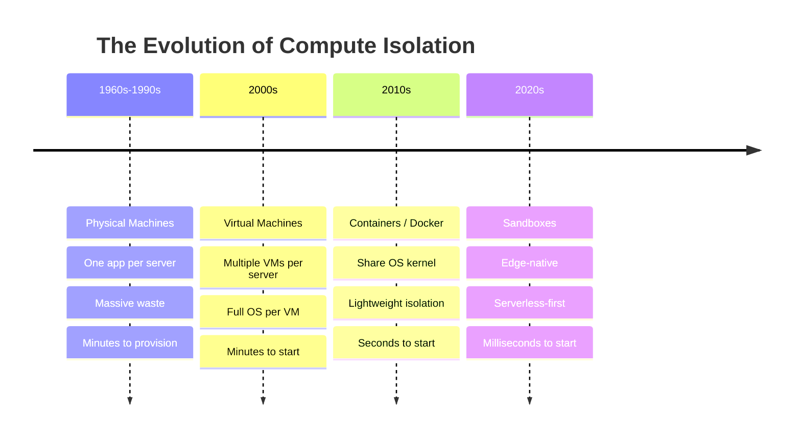

## The Discovery

I was reading [Anthropic's recent article on code execution with MCP](https://www.anthropic.com/engineering/code-execution-with-mcp)—they achieved a **98.7% reduction in token usage**, which is massive. But throughout the article, one word kept appearing: **sandbox**.

"Code execution in secure sandboxes..."
"Agents write code that runs in a sandbox environment..."
"Sandbox infrastructure enables..."


*Anthropic's article mentions that "Running agent-generated code requires a secure execution environment with appropriate **sandboxing**, resource limits, and monitoring."*

The concept wasn't explained in detail. It was assumed knowledge. But clearly, it was *critical* to everything they were describing.

So I went deep. I wanted to understand: What exactly *is* a sandbox? Why does it keep showing up in conversations about AI's future? And why does Anthropic—and increasingly, the entire industry—seem to believe this is foundational infrastructure?

Here's what I discovered. And why I believe sandboxes are as important to AI as containers were to cloud computing.

---

## The Evolution of Compute Isolation: A Story

To understand sandboxes, you need to understand the journey of how we got here. It's a story about solving the same problem—how to safely run code—at different scales:



Each evolution solved the previous layer's problem while introducing new capabilities:

**Physical Machines → Virtual Machines:** Solved hardware waste by running multiple isolated systems on one machine. But VMs were heavy (full OS each) and slow to start.

**Virtual Machines → Containers:** Solved VM overhead by sharing the OS kernel. Containers start in seconds, not minutes. Enabled cloud-native development.

**Containers → Sandboxes:** Solving orchestration complexity and edge deployment. Sandboxes are serverless-first, globally distributed, and built for AI agent workloads.

---

## Why Sandboxes for AI Agents?

Here's the key insight that Anthropic discovered: **AI agents need to write and execute code.**

Not just call APIs. Not just make tool requests. They need to write actual code—Python, JavaScript, shell scripts—and execute it safely.

This is where sandboxes shine. They combine the best of all previous technologies:

- **Fast:** Start in milliseconds (serverless-like speed)
- **Flexible:** Full file system, process management, network access (container-like power)
- **Managed:** No orchestration needed (true serverless)
- **Stateful:** Persistent environments across requests
- **Edge-native:** Globally distributed, close to users

**This is the moment sandboxes become critical.** They're the infrastructure layer that makes efficient, scalable AI agents possible.

---

## What IS a Sandbox?

Let's make this simple.

**A sandbox is like running a process inside Docker.** It has:
- Its own file system (isolated from your system)
- Its own execution environment (can't access anything outside)
- The ability to start, run code, and stop independently

Think of it like this: When kids play in a sandbox, they can build anything they want. They can make a mess. They can experiment. But the sand stays in the sandbox—it doesn't get all over the house. When they're done, you can knock it down and start fresh.

**In computing, sandboxes work the same way:**

- Code runs in complete isolation
- If it crashes or does something dangerous, it only affects the sandbox
- You get back the results (stdout, stderr, exit code)
- When you're done, the sandbox can be destroyed or reset
- Everything is safe, contained, and ephemeral

---

## Try It Yourself First (2 Minutes)

Before using my deployed sandbox, let's get one running on your machine using Cloudflare's official SDK. This is the fastest way to understand what sandboxes actually do.

**Prerequisites:**

> ⚠️ **WINDOWS USERS: WSL Required**
>
> Cloudflare Sandboxes need Linux. Windows users must use WSL2.
>
> **Don't have WSL? Install it first:**
> 1. Open PowerShell as Administrator
> 2. Run: `wsl --install`
> 3. Restart your computer
> 4. Open "Ubuntu" from Start menu (installed automatically)
> 5. Create a username and password when prompted
> 6. Run all tutorial commands in the Ubuntu terminal
>
> **Already have WSL?** Just use your Ubuntu/Linux terminal instead of PowerShell.
>
> **Tip:** Access Windows files from WSL: `/mnt/c/Users/YourName/`

**Required software:**

□ **Docker Desktop** installed and running
  - Don't have it? Download from [docker.com](https://www.docker.com/products/docker-desktop)
  - Test it works: Run `docker info` in terminal - should show Docker info, not an error
  - Make sure Docker Desktop is actually running (check system tray)

□ **Node.js 16.17.0 or later**
  - Check version: `node --version`
  - Don't have it? Download from [nodejs.org](https://nodejs.org)

□ **Windows users only: WSL2 installed**
  - What's WSL? Windows Subsystem for Linux - lets you run Linux on Windows
  - Install guide: [microsoft.com/wsl/install](https://learn.microsoft.com/en-us/windows/wsl/install)
  - Quick install: Open PowerShell as Administrator, run `wsl --install`, restart computer
  - After install: Open "Ubuntu" from Start menu - all commands run in Ubuntu terminal

□ **Cloudflare account** - NOT required for local development

**Step 1: Create project from template**

```bash
npm create cloudflare@latest my-sandbox --template=cloudflare/sandbox-sdk/examples/minimal
cd my-sandbox
```

The template will ask configuration questions—choose defaults for local testing. You can skip deployment if you don't have a Cloudflare account.

> **📦 Important:** The template doesn't include `@cloudflare/sandbox` by default. Install it now:
> ```bash
> npm install @cloudflare/sandbox
> ```

**Step 2: Replace worker code (optional - for blog integration)**

The default template only has demo endpoints. To connect your sandbox to this blog's interactive examples, replace `my-sandbox/src/index.ts` with this code:

```typescript
import { getSandbox } from '@cloudflare/sandbox';

// Export the Sandbox class (required for Durable Objects)
export { Sandbox } from '@cloudflare/sandbox';

export default {
  async fetch(request: Request, env: Env): Promise<Response> {
    const url = new URL(request.url);
    const sandbox = getSandbox(env.Sandbox, 'my-sandbox');

    // CORS headers for browser requests
    const corsHeaders = {
      'Access-Control-Allow-Origin': '*',
      'Access-Control-Allow-Methods': 'GET, POST, OPTIONS',
      'Access-Control-Allow-Headers': 'Content-Type',
    };

    if (request.method === 'OPTIONS') {
      return new Response(null, { headers: corsHeaders });
    }

    try {
      // Endpoint 1: Execute Python code (accepts GET or POST)
      if (url.pathname === '/run') {
        let code = 'print(2 + 2)'; // default demo code

        // Accept code from POST body (for longer code) or query parameter (for demos)
        if (request.method === 'POST') {
          const body = await request.json();
          code = body.code || code;
        } else {
          code = url.searchParams.get('code') || code;
        }

        // Write code to temp file and execute (handles multi-line code)
        await sandbox.writeFile('/tmp/script.py', code);
        const result = await sandbox.exec('python3 /tmp/script.py');
        return Response.json(
          {
            stdout: result.stdout,
            stderr: result.stderr,
            exitCode: result.exitCode,
          },
          { headers: corsHeaders }
        );
      }

      // Endpoint 2: File operations (demo)
      if (url.pathname === '/file') {
        await sandbox.writeFile('/workspace/hello.txt', 'Hello, Sandbox!');
        const file = await sandbox.readFile('/workspace/hello.txt');
        return Response.json({ content: file.content }, { headers: corsHeaders });
      }

      // Endpoint 3: Execute custom code (for blog integration)
      if (url.pathname === '/sandbox' && request.method === 'POST') {
        const body = await request.json();
        const { language, code } = body;

        // Convert to command format
        let command: string;
        if (language === 'python') {
          command = `python3 -c ${JSON.stringify(code)}`;
        } else if (language === 'javascript' || language === 'js') {
          command = `node -e ${JSON.stringify(code)}`;
        } else {
          return Response.json(
            { error: 'Unsupported language' },
            { status: 400, headers: corsHeaders }
          );
        }

        const result = await sandbox.exec(command);
        return Response.json(
          {
            stdout: result.stdout,
            stderr: result.stderr,
            exitCode: result.exitCode,
          },
          { headers: corsHeaders }
        );
      }

      // Default: Show available endpoints
      return new Response('Try /run, /file, or /sandbox', {
        headers: { 'Content-Type': 'text/plain', ...corsHeaders },
      });
    } catch (error) {
      return Response.json(
        { error: error instanceof Error ? error.message : 'An error occurred' },
        { status: 500, headers: corsHeaders }
      );
    }
  },
} satisfies ExportedHandler<Env>;
```

This adds:
- `/run` - Execute Python code (pass code via `?code=` query parameter, or runs demo)
- `/file` - Demo file operations (write and read files)
- `/sandbox` - Execute any language code (accepts POST JSON with `{language, code}`)
- CORS headers for browser requests

**Step 3: Start local development**

```bash
npm run dev
```

First run builds the Docker container (2-3 minutes). Subsequent runs are much faster with caching.

**Step 4: Test it**

```bash
# Execute demo Python code (GET)
curl http://localhost:8787/run

# Execute custom Python code (GET with query parameter)
curl "http://localhost:8787/run?code=print('Hello%20World')"

# Execute longer Python code (POST with JSON body - recommended)
curl -X POST http://localhost:8787/run \
  -H "Content-Type: application/json" \
  -d '{"code":"print(\"Hello from my sandbox!\")"}'

# File operations
curl http://localhost:8787/file

# Blog integration endpoint (accepts any language)
curl -X POST http://localhost:8787/sandbox \
  -H "Content-Type: application/json" \
  -d '{"language":"python","code":"print(\"Hello from my sandbox!\")"}'
```

**What success looks like:**

✅ If everything works, you'll see JSON responses like this:

```json
{
  "stdout": "4\n",
  "stderr": "",
  "exitCode": 0
}
```

**Common errors and fixes:**

❌ **"Cannot connect to Docker daemon"**
→ Docker isn't running. Start Docker Desktop and wait for it to fully start.

❌ **"ECONNREFUSED localhost:8787"**
→ Your sandbox isn't running. Make sure `npm run dev` is running in the my-sandbox directory.

❌ **"command not found: npm"**
→ Node.js isn't installed. Download from nodejs.org

❌ **"Invalid service name" or "Cannot find module"**
→ You're in the wrong directory. Run `cd my-sandbox` first, then `npm install @cloudflare/sandbox`

**Windows users:**
❌ **"docker: command not found" in PowerShell**
→ You're not in WSL. Open "Ubuntu" from Start menu, navigate to your project folder there.

**Available endpoints:**
- `/run` - Execute Python code (GET with `?code=` query parameter OR POST with JSON body)
- `/file` - Demo file operations
- `/sandbox` - Execute any language code (POST with JSON body)

**What just happened?**

In 2 minutes you:
- ✓ Spun up an isolated compute environment
- ✓ Ran Python code that can't touch your system
- ✓ Got back structured results (stdout, stderr, exitCode)
- ✓ All locally - no cloud account needed

**This is what AI agents do thousands of times per hour:**
- Write code for specific tasks
- Execute in isolation
- Process results safely
- Move to next task

**You just experienced the infrastructure behind AI's future.**

**Optional: Deploy to production**

```bash
npx wrangler deploy
```

**Note:** Deployment requires a Cloudflare account. For now, local development is enough to understand sandboxes!

Now you've run a sandbox yourself using the official SDK. You understand what it is. Let's see more examples.

---

## Experience More Examples

Now that you've run a sandbox locally, try these interactive examples with YOUR local sandbox.

**Prerequisites:**
- Your local sandbox must be running (`npm run dev` in the `my-sandbox` directory)
- Running on port 8787
- Updated with the worker code from Step 2 above

The examples below will connect to `http://localhost:8787` by default. You can change the URL if your sandbox is running on a different port.

**Try modifying the code:**
- Edit `my-sandbox/src/index.ts`
- Changes hot-reload automatically
- Click "Run in Sandbox" again to see your changes!

<SandboxTabs />

---

## The AI Agent Connection (The "Aha!" Moment)

You just did what AI agents do. But here's the critical difference:

**You clicked "Run." AI agents *write* the code, then run it.**

Think about what you just experienced:
1. You ran Python code in isolation
2. Got back structured results
3. The sandbox kept everything safe
4. It happened instantly, globally

**Now imagine this:**
- An AI agent receives your request: "Analyze this customer data and find patterns"
- The agent *writes* a Python script to process the data
- Executes it in a sandbox (just like you did)
- Gets the results without ever exposing raw data to the model
- Returns insights to you

**This is the breakthrough Anthropic discovered.**

Instead of loading 150,000 tokens of tool definitions into context, AI agents:
- Write custom code for each task (2,000 tokens)
- Execute it in sandboxes
- Process data safely and efficiently
- **98.7% token reduction**

**The power multiplies:**
- Agents build libraries of reusable scripts ("skills")
- Each task generates optimized code
- Sensitive data stays in the sandbox
- Workflows become dynamic, not static
- Every problem gets a custom solution

You've now experienced the infrastructure behind AI's future. Sandboxes aren't just a tool—they're what makes truly capable AI agents possible.

---

## Why This Matters: Anthropic's World of Possibilities

Remember Anthropic's 98.7% token reduction? That was only possible because of sandboxes.

Here's why:

**Without sandboxes:** AI agents make direct tool calls. Every tool definition loads into context (150,000 tokens). Every intermediate result flows through the model (duplicate data, wasted tokens, high costs).

**With sandboxes:** Agents write code that runs in a sandbox. Load only the tools you need (2,000 tokens). Process data in the sandbox before returning results to the model. 98.7% reduction.

But the efficiency gains are just the beginning. Sandboxes unlock an entire world of possibilities:

### What Becomes Possible

**1. Safe AI Code Execution**
AI models can generate code (they're good at it). But you can't just execute that code in your production environment. Sandboxes give you a safe place to run AI-generated code at scale.

**2. Privacy-Preserving Workflows**
Sensitive data can flow through the sandbox without ever entering the model's context. Process customer data, run analytics, generate reports—all while keeping PII tokenized or isolated.

**3. Long-Running Processes**
Unlike typical serverless functions (30 seconds max), sandboxes can run for 45+ minutes. CI/CD pipelines, data processing, model training—all possible.

**4. Continuous Learning**
Agents can save their working code as reusable "skills." Over time, they build a library of capabilities. They get better without retraining the model.

**5. Dynamic Workflows**
This is the big one. Instead of hard-coded, static workflows, agents can create workflows on-demand. "Here's what I need to do. Let me write the code to do it. Done." Every workflow is unique. Every solution is tailored.

Anthropic didn't just discover a performance optimization. They discovered a new way of building with AI. And sandboxes are the infrastructure that makes it possible.

---

## The Seed is Planted

You now understand what sandboxes are. You've run one locally. You've seen how AI agents use them. And you understand why Anthropic's breakthrough was only possible because of this infrastructure.

*Sandboxes are to AI agents what containers were to cloud computing.*

They're not just a tool. They're foundational infrastructure.

But understanding what they are is just the beginning. In the next article, we'll explore how to actually build with them—the architecture, deployment, and real-world patterns that make AI agents truly capable.

For now, I want you to sit with this idea: **What becomes possible when AI agents can write and execute code safely at global scale?**

The future Anthropic described? It's being built on sandboxes.

---

## Resources

**Learn More:**
- [Anthropic's Code Execution with MCP](https://www.anthropic.com/engineering/code-execution-with-mcp) - The article that started this exploration
- [Cloudflare Sandbox Documentation](https://developers.cloudflare.com/sandbox/) - Official docs and guides
- [Model Context Protocol](https://modelcontextprotocol.io/) - The standard for AI-tool integration

**Experiment:**
- Get started: [Cloudflare Sandbox Get Started Guide](https://developers.cloudflare.com/sandbox/get-started/)
- Quick start: `npm create cloudflare@latest my-sandbox -- --template=cloudflare/sandbox-sdk/examples/minimal`
- Custom worker code shown in Step 2 above (includes blog integration endpoint)
- Explore the [Cloudflare Sandbox SDK](https://github.com/cloudflare/sandbox-sdk) on GitHub

---

*Coming next: "Sandbox Architecture Deep Dive: How to Build Production AI Agents"*
