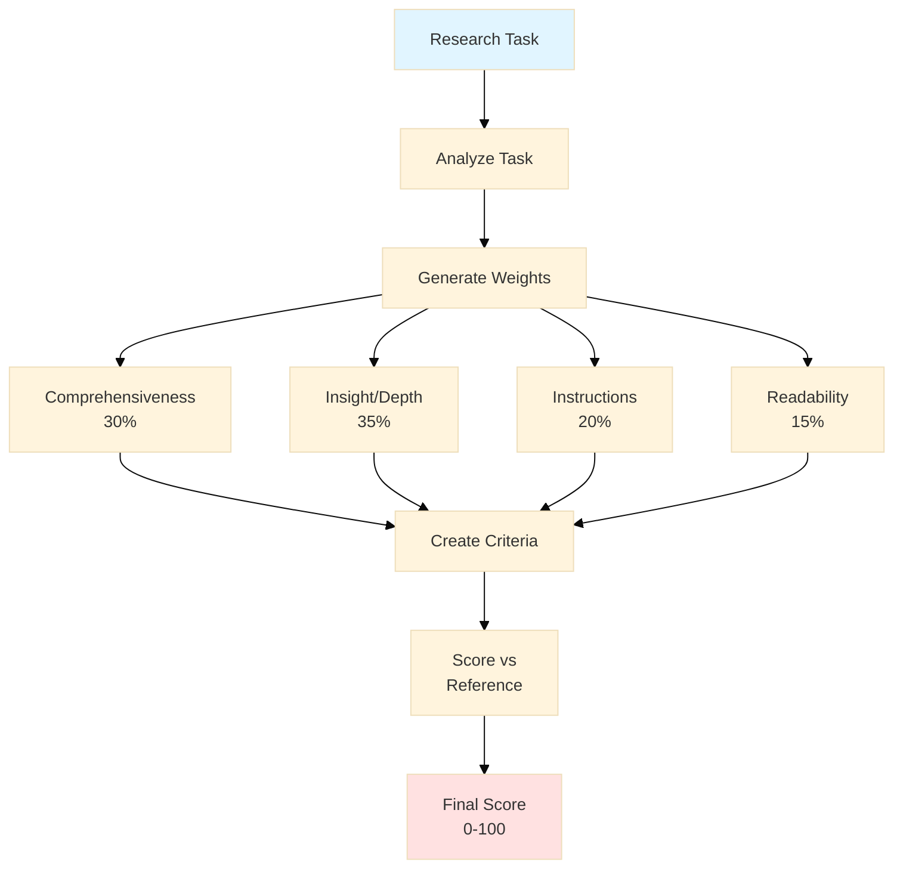
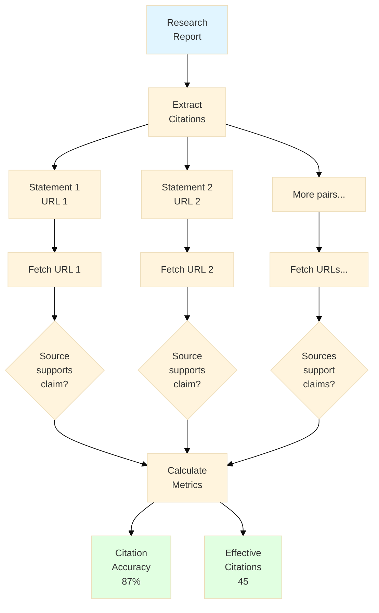
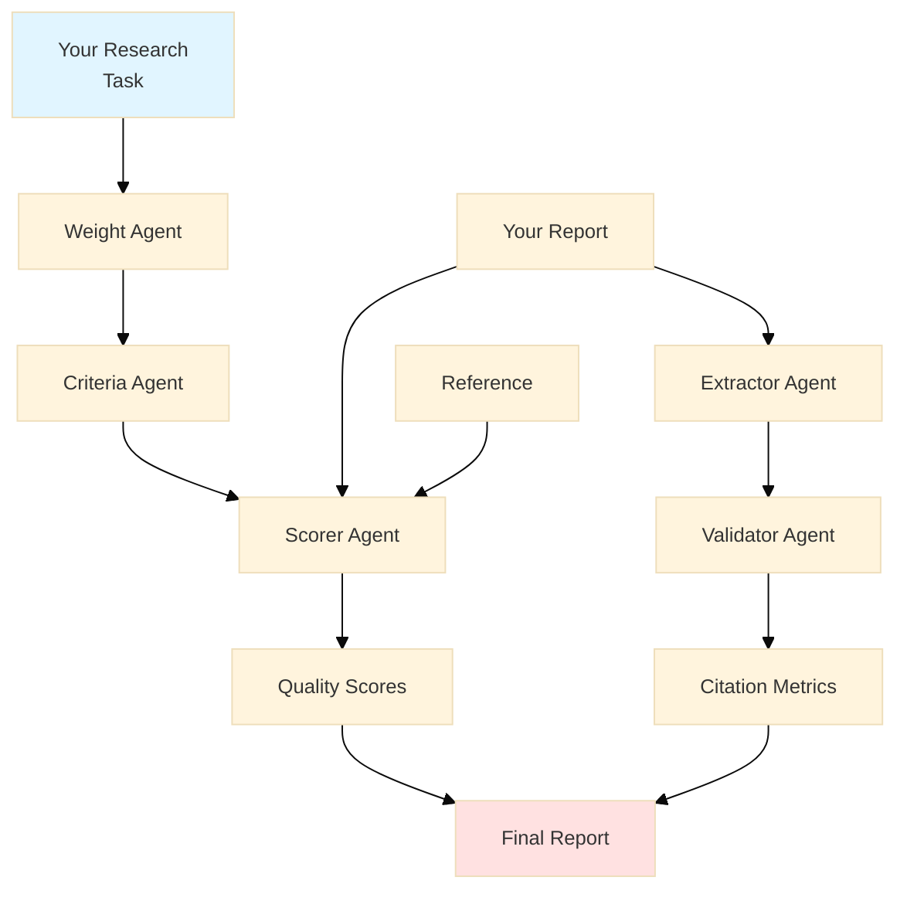

# How to Actually Evaluate AI Research Agents

When ChatGPT first got the ability to browse the web, something interesting happened. People started asking it to write research reports. Then Claude got the same ability. Then Perplexity built an entire product around it.

Now we have "Deep Research Agents" - AI systems that spend 10-15 minutes gathering information, reading dozens of sources, and writing comprehensive reports on complex topics. They're genuinely useful. I've used them.

But here's the problem: **How do you know if one is better than another?**

You might think "just read the reports and see which is better." But that doesn't scale. And humans disagree. A lot. When PhD experts evaluated the same research report, they often contradicted each other.

So how do you evaluate something when there's no single right answer?

## The Two-Part Solution

A group of researchers created DeepResearch Bench, which evaluates these agents in two ways:

1. **RACE**: How good is the writing?
2. **FACT**: Are the citations real?

Let me explain each.

## RACE: The Quality Framework

RACE stands for "Reference-based Adaptive Criteria-driven Evaluation with Dynamic Weighting." Terrible acronym, but clever idea.

Here's the key insight: **Different research tasks need different evaluation criteria.**

If someone asks you to "analyze Tesla's stock performance," comprehensiveness matters more than writing style. But if they ask you to "explain quantum computing to a 10-year-old," readability matters more than exhaustive detail.

So RACE adapts. Here's how it works:



### Step 1: Dynamic Weights

The system looks at your task and decides what matters.

For a PhD-level analysis of UAV control systems, it might assign:
- Comprehensiveness: 30%
- Insight: 35%
- Following instructions: 20%
- Readability: 15%

For a beginner's guide to investing, those weights would flip.

### Step 2: Adaptive Criteria

Instead of using the same checklist for everything, RACE generates task-specific criteria.

**For the UAV task:**
- "Does the report cover PID tuning methods comprehensively?"
- "Does it analyze trade-offs between different control approaches?"

**For the investing guide:**
- "Does it use simple, jargon-free language?"
- "Does it include practical, actionable examples?"

### Step 3: Reference-Based Scoring

Here's the clever part: instead of scoring reports in isolation, RACE compares them to a high-quality reference report.

Why? Because AI judges (yes, the scoring is done by AI) tend to give everything 7-8 out of 10. They're too nice. But they're much better at saying "Report A is better than Report B on this criterion."

So RACE scores both reports, then calculates a relative score:

```
Final Score = Target Score / (Target Score + Reference Score) × 100
```

This spreads scores out more realistically.

## FACT: The Citation Checker

Writing quality matters, but so does accuracy. This is where FACT comes in.

FACT is simpler to explain:



### How FACT Works

1. **Extract**: Find every claim-citation pair
   - Example: "Remote work adoption reached 58% [Source]"

2. **Validate**: Fetch the URL. Does it actually say that?

3. **Calculate** two metrics:
   - **Citation Accuracy**: What percentage of citations actually support their claims?
   - **Effective Citations**: How many verified facts did the agent find?

The second metric is important. An agent could have 100% citation accuracy by only citing one thing. But that's not very comprehensive. Effective citations measures breadth.

## Real Results

Here's what they found when testing real Deep Research agents:

| Agent | Quality Score | Citation Accuracy | Effective Citations |
|-------|--------------|-------------------|---------------------|
| Gemini 2.5 Pro DR | 48.9 | 81.4% | 111 |
| OpenAI DR | 47.0 | 78.0% | 41 |
| Perplexity DR | 42.3 | 90.2% | 31 |
| Grok Deeper Search | 40.2 | 83.6% | 8 |

Notice something? **The "best" agent depends on what you care about.**

- Perplexity has the most accurate citations (90.2%)
- Gemini writes the best reports (48.9) and finds the most facts (111)
- They're solving different problems

## The Human Test

The researchers did something important: they checked if their automated scores matched human experts.

They had 70+ PhD-level annotators evaluate reports. Then they compared those scores to RACE's scores.

The result? **71.3% agreement** - meaning RACE agreed with humans on which report was better 71% of the time.

That's actually better than humans agreed with each other (68.4%).

## Why This Matters

Three things make this approach clever:

### 1. It adapts to the task

Most benchmarks use the same criteria for everything. RACE generates new criteria for each task. This matches how humans actually evaluate - we judge a children's book differently than a technical manual.

### 2. It's reference-based

Absolute scoring is hard. Relative scoring is easier.

"Is this better than that?" is a simpler question than "How good is this?"

### 3. It validates citations

This is critical. Language models are very good at writing confident-sounding nonsense.

Checking if sources actually say what the report claims they say is non-negotiable.

## The Bigger Picture

We're moving toward AI systems that do real research work. Not just answering questions, but going deep on topics, synthesizing information, and producing comprehensive analyses.

As these systems improve, we need better ways to evaluate them. Not just "did it answer correctly?" but:
- Did it research thoroughly?
- Did it cite accurately?
- Did it write clearly?
- Did it follow instructions?

DeepResearch Bench is one answer to that question. It's not perfect - the researchers list several limitations - but it's a serious attempt at measuring something complex.

And that matters. **Because you can't improve what you can't measure.**

## How It Actually Works

The system uses 5 specialized AI sub-agents working together:



### The Sub-Agents

1. **Weight Agent**: Analyzes your task, decides what matters most
2. **Criteria Agent**: Creates specific evaluation criteria for your task
3. **Scorer Agent**: Compares your report to the reference
4. **Extractor Agent**: Finds all citations in your report
5. **Validator Agent**: Checks if citations are real and accurate

They work in parallel where possible, making evaluation fast.

## Try It Yourself

The evaluation framework is open source. You can run it on your own research reports.

It uses Claude Agent SDK with a simple command:

```
/deepresearch-eval task="Your research question" report_path="your_report.md" reference_path="reference.md"
```

The system will:
- Generate evaluation weights for your specific task
- Create custom criteria
- Score your report comparatively
- Validate every single citation
- Give you a detailed breakdown

## What You Get

After evaluation, you receive:

**Quality Breakdown:**
- Overall score (0-100)
- Scores for each dimension (Comprehensiveness, Insight, etc.)
- Detailed analysis of what worked and what didn't
- Specific feedback on each criterion

**Citation Analysis:**
- Total citations found
- How many are accurate
- Which citations failed validation
- Why they failed

**Full Report:**
- JSON file with complete data
- Markdown report you can read
- Timestamp and metadata

## For Developers

If you're building AI research tools, this framework gives you:

- A way to benchmark your system
- Comparison against other research agents
- Specific areas to improve
- Validation that your citations are real

If you're using AI research tools, this is how the better ones are being evaluated.

## The Future

As AI research agents get more capable, evaluation becomes more critical.

We're past simple accuracy tests. We need nuanced frameworks that match how humans judge quality work:
- Does it understand context?
- Does it adapt to different needs?
- Does it cite sources honestly?
- Does it write clearly?

DeepResearch Bench shows one path forward. It's adaptive, reference-based, and validates facts.

Most importantly, it aligns with human judgment while being automated and scalable.

That's the future of AI evaluation: systems that think like human experts, but work at machine speed.

---

## Quick Summary

If you only remember three things:

1. **RACE evaluates quality** by adapting to each task and comparing against references
2. **FACT validates citations** by actually fetching sources and checking claims
3. **It matches human experts** 71% of the time, better than experts match each other

---

## Learn More

- **Paper**: "DeepResearch Bench: A Comprehensive Benchmark for Deep Research Agents" by Du et al., 2025
- **Code**: Open source implementation with Claude Agent SDK
- **Try it**: Use the `/deepresearch-eval` slash command

---

*Want to evaluate your AI research reports? The framework is ready to use. Just install the dependencies and run the slash command.*

*Building an AI research agent? This is how you'll be benchmarked.*

*Either way, welcome to the future of AI evaluation.*
