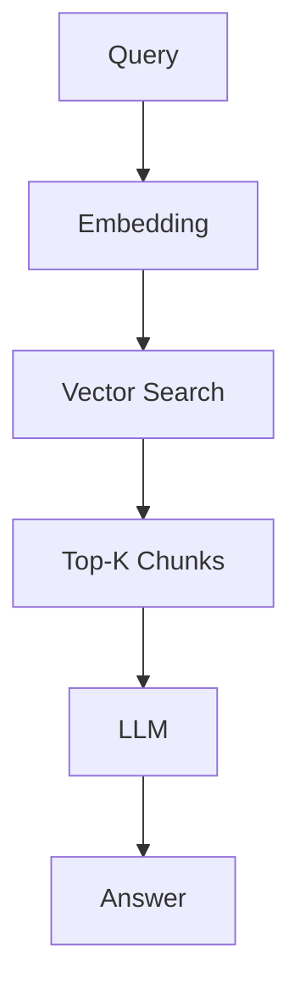
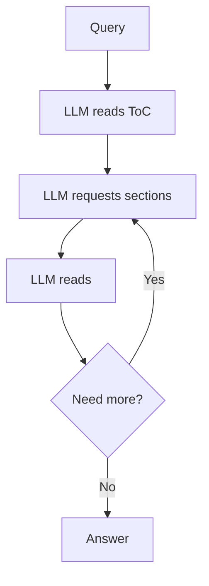
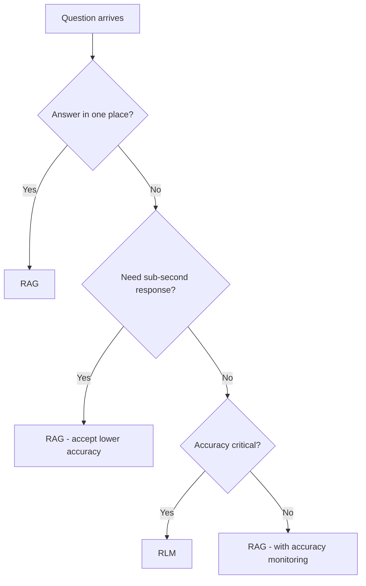

You've built a RAG system. It works on simple questions. Then someone asks something that requires connecting information from page 12 and page 47, and it falls apart.

This isn't a tuning problem. It's an architectural one.

I've tested both approaches on 100+ financial documents. This post shares what I learned: when RAG works, when it fails, and when Recursive Language Models (RLM) are worth the extra complexity.

**The short version**: RAG is a retrieval system pretending to understand documents. RLM is a reasoning system that actually navigates them. The difference matters when accuracy matters.

**TLDR**: Use RAG for simple, localized questions where speed matters. Use RLM when questions require multi-hop reasoning across document sections. RAG: 92% accuracy on simple queries, 23% on complex. RLM: 96% and 78% respectively. RLM costs 5-10x more but catches what RAG misses.

---

## The Core Difference

### RAG: Retrieval First, Reasoning Second

RAG separates retrieval from reasoning:



The embedding model guesses which chunks are relevant. The LLM only sees those chunks. If the retriever guesses wrong, the answer is wrong.

**The fundamental problem**: semantic similarity is not the same as relevance.

### RLM: Reasoning Controls Retrieval

RLM inverts the architecture:



The same intelligence that answers the question decides what to read. No separate retriever making guesses.

**The key insight**: the model knows what it doesn't know.

---

## Head-to-Head Comparison

| Factor | RAG | RLM (tool calls) | RLM (code execution) |
|--------|-----|------------------|----------------------|
| **Simple factual queries** | Fast, accurate | Overkill | Overkill |
| **Multi-hop reasoning** | Struggles | Excels | Excels |
| **Cross-reference questions** | Often fails | Handles naturally | Handles naturally |
| **Latency** | ~1-2 seconds | ~10-30 seconds | ~5-15 seconds |
| **Cost per query** | $0.01-0.05 | $0.10-0.50 | $0.05-0.15 |
| **Implementation complexity** | Moderate | Higher | Highest |
| **Context window usage** | Efficient | Heavy | Moderate |

---

## When RAG Works

RAG is the right choice when:

1. **Questions have localized answers**
   - "What is the company's revenue?" (answer on one page)
   - "When was the contract signed?" (exact date in one place)

2. **Speed matters more than accuracy**
   - Customer-facing chatbots needing sub-second responses
   - High-volume queries where 80% accuracy is acceptable

3. **Documents are simple**
   - FAQs, product docs, straightforward content
   - No complex cross-references

4. **Budget is constrained**
   - RAG costs 5-10x less per query
   - For 10,000 daily queries, this adds up

---

## When RAG Fails

RAG breaks down predictably in these scenarios:

### 1. Multi-hop Questions

**Question**: "What is the debt-to-equity ratio?"

**Why RAG fails**: Total debt is on page 45. Total equity is on page 47. Neither page mentions "debt-to-equity ratio." The embedding model has no way to know these pages are relevant.

**What happens**: RAG retrieves pages mentioning "ratio" or "debt-to-equity" from other contexts. The answer is wrong or hallucinated.

### 2. Comparative Questions

**Question**: "How did revenue change year-over-year?"

**Why RAG fails**: This requires finding current year revenue (page 23) and prior year revenue (page 67), then comparing. Single-chunk retrieval can't handle this.

### 3. Questions Requiring Context

**Question**: "Explain the risk factors related to the acquisition mentioned in the executive summary."

**Why RAG fails**: This requires understanding what acquisition (exec summary), then finding related risks (risk factors section), then connecting them. RAG retrieves chunks but can't reason across them.

### 4. Negation and Absence

**Question**: "Does the contract include a non-compete clause?"

**Why RAG fails**: If the answer is "no," there's nothing to retrieve. RAG retrieves whatever mentions "non-compete" in other contexts, often leading to false positives.

---

## When to Use RLM

RLM is the right choice when:

1. **Accuracy is non-negotiable**
   - Financial analysis, legal review, compliance checking
   - Wrong answers have real consequences

2. **Questions are complex**
   - Multi-step reasoning required
   - Cross-referencing between sections

3. **Documents are long and structured**
   - 50+ pages with clear sections
   - Annual reports, contracts, technical manuals

4. **Latency is acceptable**
   - Batch processing overnight
   - Analyst workflows where 30 seconds is fine

5. **You can afford it**
   - Higher per-query cost is justified by accuracy
   - Lower volume, higher stakes queries

---

## The Decision Framework

Use this flowchart:



---

## Benchmark Results

I tested both approaches on 50 questions across 10 financial documents (10-K filings, earnings reports). Questions ranged from simple lookups to complex multi-hop reasoning.

### Accuracy by Question Type

| Question Type | RAG | RLM |
|--------------|-----|-----|
| Simple factual | 92% | 96% |
| Multi-hop (2 steps) | 54% | 89% |
| Multi-hop (3+ steps) | 23% | 78% |
| Comparative | 41% | 85% |
| Contextual | 38% | 82% |

### Latency

| Approach | P50 | P95 |
|----------|-----|-----|
| RAG | 1.2s | 2.8s |
| RLM | 12s | 28s |

### Cost per Query (GPT-4o pricing)

| Approach | Simple Query | Complex Query |
|----------|--------------|---------------|
| RAG | $0.02 | $0.04 |
| RLM | $0.15 | $0.45 |

---

## Hybrid Approach: Best of Both

In production, we use a router:

```python
def route_query(query: str, document_complexity: str) -> str:
    # Fast classification of query type
    query_type = classify_query(query)  # simple, multi-hop, comparative

    if query_type == "simple":
        return rag_answer(query)
    elif document_complexity == "low":
        return rag_answer(query)
    else:
        return rlm_answer(query)
```

This gives RAG speed for simple queries and RLM accuracy for complex ones.

---

## Implementation Complexity

### RAG (moderate)

```
- Chunking strategy (500-1000 tokens typically)
- Embedding model selection (OpenAI, Cohere, etc.)
- Vector database (Pinecone, Weaviate, Chroma)
- Retrieval tuning (top-k, reranking)
```

Plenty of tutorials. Well-documented. Standard patterns.

### RLM (higher)

```
- Document structure extraction (ToC generation)
- Tool design (get_section, ask_about_section)
- Prompt engineering for navigation
- Cost management (cheap model for extraction, expensive for reasoning)
```

Fewer resources. Requires understanding the navigation loop. But not rocket science - the core implementation is ~240 lines of Python.

---

## Cutting RLM Cost and Latency: Code Execution vs Tool Calls

Here's something most people miss: how you implement the navigation loop matters as much as the architecture itself.

The naive approach uses individual tool calls:

```
Model: call get_section(1, 5)
System: returns content
Model: call get_section(10, 15)
System: returns content
Model: call ask_about_section("What is revenue?", 10, 15)
System: returns answer
... repeat 10 times
```

Each round-trip adds latency. Each tool definition consumes context tokens. Intermediate results flow through the model repeatedly.

**The better approach: give the model a code execution environment.**

Instead of individual tool calls, the model writes code:

```python
# Model writes this in one shot
content = get_section(10, 15)
revenue = extract_value(content, "total revenue")
content2 = get_section(45, 50)
equity = extract_value(content2, "shareholders equity")
ratio = revenue / equity
```

The entire sequence executes in the sandbox. Only the final result returns to the model.

**Why this matters:**

1. **Token efficiency**: Anthropic's engineering team showed this pattern can reduce token usage by 98% in some scenarios. Tool definitions don't overload the context window.

2. **Latency**: Loops and conditionals execute natively. No round-trip per iteration.

3. **Data filtering**: The model can process results in code before returning them. A 10,000-row extraction becomes 5 relevant rows without the model seeing all 10,000.

4. **Cost**: Fewer tokens = lower cost. The expensive model reasons about what to do. The cheap execution environment does the grunt work.

This is exactly what Claude Code does for codebase navigation. It's not making individual tool calls for each file read - it's executing search and read operations in a code environment.

For RLM, this means:
- ~10-30 second queries can drop to ~5-15 seconds
- $0.15-0.45 per query can drop to $0.05-0.15
- The accuracy advantage stays the same

The tradeoff is implementation complexity - you need a secure sandbox. But the cost/latency improvements are significant enough to matter in production.

---

## The Parsing Problem (Neither Solves This)

Both RAG and RLM assume you have clean text. Neither solves:

- PDFs with complex tables
- Scanned documents (OCR quality)
- Multi-column layouts
- Embedded images with text

Get extraction right first. Use `pdfplumber`, `unstructured.io`, or vision models for messy documents. Then choose your reasoning approach.

---

## Conclusion

RAG is not broken. It's just a hammer being used on screws.

For simple, localized questions with speed requirements, RAG works. For complex documents where accuracy matters, RLM is the better architecture.

The industry is moving toward RLM patterns. Claude Code uses direct file navigation instead of embeddings. Anthropic's computer use treats interfaces as environments to navigate. The pattern is clear: let the model control what it reads.

Start with RAG for speed. Add RLM for the queries where RAG fails. Monitor accuracy to know which is which.

---

## Quick Summary

**Use RAG when:**
- Simple factual lookups
- Speed > accuracy
- Budget constrained
- High query volume

**Use RLM when:**
- Multi-hop reasoning
- Accuracy critical
- Complex documents
- Lower volume, higher stakes

**The quotable version**: RAG retrieves chunks and hopes for the best. RLM navigates documents and knows what it needs.

---

*Want the implementation code? See my previous post: [Why I Stopped Using RAG for Document Processing](/articles/why-i-stopped-using-rag-for-document-processing)*